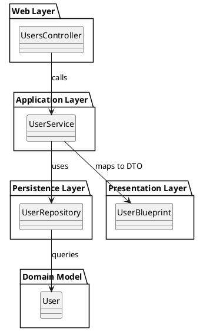

# Rails-Domino

[](https://badge.fury.io/rb/rails-domino)

**`rails-domino`** (Further just Domino) is a gem for Rails that can turn **any existing database** into a fully functioning, self-documented, and maintainable **web API in seconds**.

It scaffolds a clean, layered architecture around your domain models using **service**, **repository**, **blueprint**, and **controller** patterns. Domino supports both **code-first** and **database-first** workflows, making it ideal for rapid prototyping, legacy system modernization, and scalable system design.

---

## Key Features

- **Database-first**: Automatically generate a full API from any schema
- **Code-first**: Build new domains using CLI generators
- **Self-documenting**: All layers include YARD comments
- **Clean structure**: Layered, testable, and SRP-compliant

---

## Architecture Pattern

Domino follows a **Layered Architecture** inspired by **Domain-Driven Design (DDD)**, with principles borrowed from **Clean Architecture** and **Hexagonal Architecture**.

### Core Components

- **Model** – Optional; generated from DB schema or via `--with-model`
- **Repository** – Encapsulates data access (e.g., ActiveRecord)
- **Service** – Encapsulates domain/business logic
- **Blueprint** – Maps models to response DTOs (via Blueprinter)
- **Controller** – Exposes RESTful APIs and delegates to services

---

## Domino's Domain-Driven Principles

Domino applies several modern architectural foundations:

- **Domain-Driven Design** (Eric Evans) – Focuses logic around real business concepts
- **Clean Architecture** (Uncle Bob) – Layers with inward-pointing dependencies
- **Service Layer Pattern** (Martin Fowler) – Isolates orchestration logic
- **AutoMapper-style Mapping** – Declarative data shaping with Blueprinter

---

## Installation

Add Domino to your Rails app:

```ruby
# Gemfile
gem "rails-domino"
```

Then run:

```bash
bundle install
```

---

## Usage

---

### Database-First Workflow

From the Rails console:

```ruby
Domino.scaffold
```

Domino will introspect your database schema and generate:
- Models (optional)
- Repositories
- Services
- Blueprints
- Controllers

Customize as needed:

```ruby
Domino.scaffold(
  tables: ['users'], # a white list of required tables
  generate_model: false
)
```

---

### Code-First Workflow

Generate a fully layered domain module:

```bash
rails generate domino user name:string email:string active:boolean --with-model
```

Creates:
- `User` model + migration (optional)
- `UserService`, `UserRepository`, `UserBlueprint`
- `UsersController`

Add to your routes:

```ruby
resources :users
```

---

## Example Controller

Domino generates a RESTful controller with all standard actions:

```ruby
class UserController < ApplicationController
  include Import['user_service']

  # GET /user
  # @return [JSON]
  def index
    render json: UserBlueprint.render(@user_service.all)
  end

  # GET /user/:id
  # @return [JSON]
  def show
    render json: UserBlueprint.render(@user_service.get(params[:id]))
  end

  # POST /user
  # @return [JSON]
  def create
    obj = @user_service.create(resource_params)
    render json: UserBlueprint.render(obj), status: :created
  end

  # PATCH/PUT /user/:id
  # @return [JSON]
  def update
    obj = @user_service.update(params[:id], resource_params)
    render json: UserBlueprint.render(obj)
  end

  # DELETE /user/:id
  # @return [NoContent]
  def destroy
    success = @user_service.delete(params[:id])
    head(success ? :no_content : :not_found)
  end

  private

  # @return [ActionController::Parameters]
  def resource_params
    params.require(:user).permit(:name)
  end
end
```

All actions call your service layer and return serialized responses via blueprints.

---

## Architecture Diagram (PlantUML)



---

## YARD Documentation

All generated files include YARD-style comments for easy documentation and tooling support.

Generate docs with:

```bash
yardoc
```

Or, pair domino with the excellent [oas_rails](https://github.com/a-chacon/oas_rails) for a complete self documented API with OAS RapiDoc.

---

## Notes

- Rails 8+ supported
- Compatible with `dry-auto_inject` and `blueprinter`
- Ideal for API-only or full-stack Rails apps
- Clean file output — no clutter or over-generation

---

## License

MIT

## Contributing

Pull requests welcome! Please ensure tests and docs are up to date.
