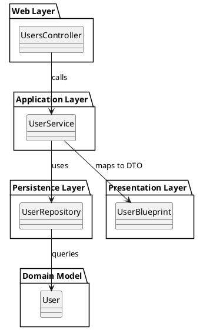

# Rails-Domino

[](https://badge.fury.io/rb/rails-domino)
[](LICENSE)

**`rails-domino`** (Further just Domino) is a gem for Rails that can turn **any existing database** into a fully functioning, self-documented, and maintainable **web API in seconds**.

It scaffolds a clean, layered architecture around your domain models using **service**, **repository**, **blueprint**, and **controller** patterns. Domino supports both **code-first** and **database-first** workflows, making it ideal for rapid prototyping, legacy system modernization, and scalable system design.

---

## Key Features

- **Database-first**: Automatically generate a full API from any schema
- **Code-first**: Build new domains using CLI generators
- **Self-documenting**: All layers include YARD comments
- **Clean structure**: Layered, testable, and SRP-compliant

---

## Architecture Pattern

Domino follows a **Layered Architecture** inspired by **Domain-Driven Design (DDD)**, with principles borrowed from **Clean Architecture** and **Hexagonal Architecture**.

### Core Components

- **Model** – Optional; generated from DB schema or via `--with-model`
- **Repository** – Encapsulates data access (e.g., ActiveRecord)
- **Service** – Encapsulates domain/business logic
- **Blueprint** – Maps models to response DTOs (via Blueprinter)
- **Controller** – Exposes RESTful APIs and delegates to services

---

## Domino's Domain-Driven Principles

Domino applies several modern architectural foundations:

- **Domain-Driven Design** (Eric Evans) – Focuses logic around real business concepts
- **Clean Architecture** (Uncle Bob) – Layers with inward-pointing dependencies
- **Service Layer Pattern** (Martin Fowler) – Isolates orchestration logic
- **AutoMapper-style Mapping** – Declarative data shaping with Blueprinter

#### Controllers

Controllers should be thin and focused solely on handling HTTP-level concerns. Their primary role is to delegate incoming requests to the appropriate service methods and return serialized output via Blueprints. They should not contain business logic, transformations, or model manipulation. This separation ensures controllers remain predictable, testable, and easily maintainable.

#### Blueprints

Blueprints act as response serializers and define the API's data contracts. They shape the output of domain entities into well-defined, consumer-facing structures, often selectively exposing only necessary fields or calculated properties. This promotes schema clarity, encapsulation, and forward compatibility while reducing overexposure of internal data. Blueprints are not bound 1:1 to models and support flexible, nested, or transformed output using [Blueprinter](https://github.com/procore/blueprinter).

#### Services

Services encapsulate all domain and business logic. They serve as orchestrators that coordinate between repositories and other services, apply rules, perform calculations, and prepare data for rendering. Services do **not** represent DTOs themselves, instead, they return plain Ruby objects (POROs) or data structures (e.g. hashes, value objects) that are then serialized by Blueprints. Keeping logic in services enforces Single Responsibility Principle and allows business logic to evolve independently of HTTP concerns.

#### Repositories

Repositories provide a consistent abstraction over data persistence and querying. Each repository corresponds to a domain model and exposes common CRUD operations. Repositories should not contain business logic or transformation logic; they strictly handle fetching and persisting domain entities. Custom query methods can be added where needed, but the repository layer should remain thin and predictable, only leveraging known relationships and rejecting expensive, convoluted, or join-heavy queries.

#### Models

Models represent the domain entities and are typically implemented using ActiveRecord. In Domino, models are intentionally kept lean, their purpose is to encapsulate the raw data schema and define associations, validations, and basic behaviour. 

Business logic, rule orchestration, or data transformation should **not** reside in the model. These responsibilities are handled by the service layer. This separation promotes testability, maintainability, and decoupling from the persistence layer.

Domino can work with both:
- **Existing models**: If you have pre-defined ActiveRecord models, Domino will use them.
- **Generated models**: In database-first workflows, Domino can auto-generate skeletal models based on the database schema using the `--with-model` flag.

While ActiveRecord is the default ORM, Domino’s architecture allows for future substitution of the persistence strategy due to its layered boundaries.

---

## Dependency Injection with dry-rb

Domino uses a Ruby-idiomatic form of **Dependency Injection (DI)** powered by the [`dry-container`](https://dry-rb.org/gems/dry-container) and [`dry-auto_inject`](https://dry-rb.org/gems/dry-auto_inject) gems. This promotes a modular, testable, and loosely coupled architecture without the need for _Rails magic_ or global state.

### How It Works

Each layer of the application is wired explicitly:

- **Controllers** inject their corresponding **services**
- **Services** inject their associated **repositories**

For example:

```ruby
# app/services/user_service.rb
class UserService
  include Domino::Import["user_repository"]
end

```

#### Loose Coupling  
Services and controllers don’t create their dependencies, they receive them. This enables:
- Flexible substitution
- Easy refactoring
- Decoupling from implementation details

#### Simplified Testing  
Inject mocks or fakes in tests without any monkey-patching:

```ruby
user_service = UserService.new(user_repository: FakeRepo.new)
```

Test units in complete isolation without invoking the whole stack.

#### Explicit and Transparent  
Every class declares exactly what it depends on. No hidden dependencies, no guessing:

```ruby
include Import["awesome_service"]
```

After creating the components, Domino will generate an initializer (if it doesn't already exist), and register the services and repositories.

```ruby
# config/initializers/domino_container.rb
Domino::Container.register("user_service", -> { UserService.new })
Domino::Container.register("user_repository", -> { UserRepository.new })
```

For every Domino generation, this file will be appended.

---

## Installation

Add Domino to your Rails app:

```ruby
# Gemfile
gem "rails-domino"
```

Then run:

```bash
bundle install
```

---

## Usage

---

### Database-First Workflow

From the Rails console:

```ruby
Domino.scaffold
```

Domino will introspect your database schema and generate:
- Models (optional)
- Repositories
- Services
- Blueprints
- Controllers

Customize as needed:

```ruby
Domino.scaffold(
  tables: ['users'], # a white list of required tables
  generate_model: false
)
```

Domino assumes models do not already exist and defaults to creating them when executed database-first.

---

### Code-First Workflow

Generate a fully layered domain module:

```bash
rails generate domino user name:string email:string active:boolean --with-model
```

Creates:
- `User` model + migration (optional)
- `UserService`, `UserRepository`, `UserBlueprint`
- `UsersController`

Add to your routes:

```ruby
resources :users
```

Domino assumes models already exist when the generator is used code-first and defaults to creating them only when `--with-model` is set. This will pass into a migration generation. Domino **will not** auto execute migrations.

---

## Example Controller

Domino generates a RESTful controller with all standard actions. The service is injected into a method:

```ruby
class UserController < ApplicationController
  # GET /user
  # @return [JSON]
  def index
    render json: UserBlueprint.render(user_service.all)
  end

  # GET /user/:id
  # @return [JSON]
  def show
    render json: UserBlueprint.render(user_service.get(params[:id]))
  end

  # POST /user
  # @return [JSON]
  def create
    obj = user_service.create(resource_params)
    render json: UserBlueprint.render(obj), status: :created
  end

  # PATCH/PUT /user/:id
  # @return [JSON]
  def update
    obj = user_service.update(params[:id], resource_params)
    render json: UserBlueprint.render(obj)
  end

  # DELETE /user/:id
  # @return [NoContent]
  def destroy
    success = user_service.delete(params[:id])
    head(success ? :no_content : :not_found)
  end

  private

  def user_service
    @user_service ||= Domino::Container["user_service"]
  end

  # @return [ActionController::Parameters]
  def resource_params
    params.require(:user).permit(:name)
  end
end
```

All actions call your service layer and return serialized responses via blueprints.

---

## Architecture Diagram (PlantUML)



---

## YARD Documentation

All generated files include YARD-style comments for easy documentation and tooling support.

Generate docs with:

```bash
yardoc
```

Or, pair domino with the excellent [oas_rails](https://github.com/a-chacon/oas_rails) for a complete self documented API with OAS RapiDoc.

---

## Notes

- Rails 8+ supported
- Compatible with `dry-auto_inject` and `blueprinter`
- Ideal for API-only or full-stack Rails apps
- Clean file output — no clutter or over-generation

---

## License

MIT License © kiebor81

## Contributing

Pull requests welcome! Please ensure tests and docs are up to date.
